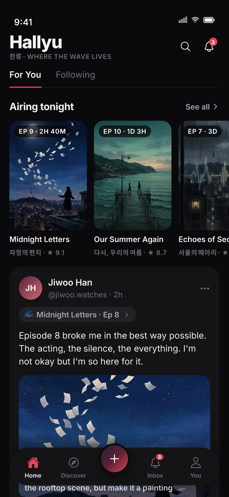
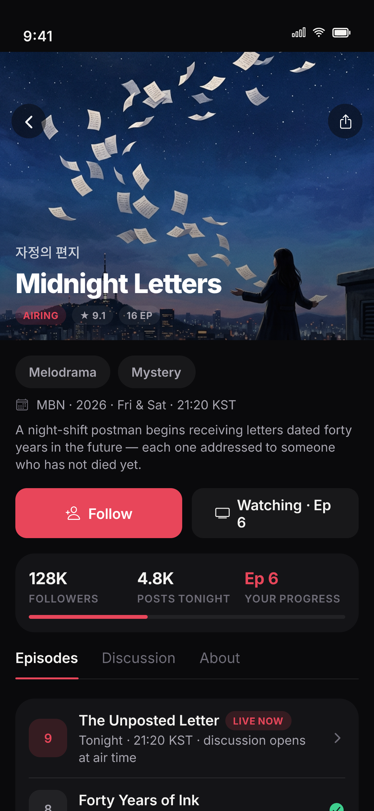
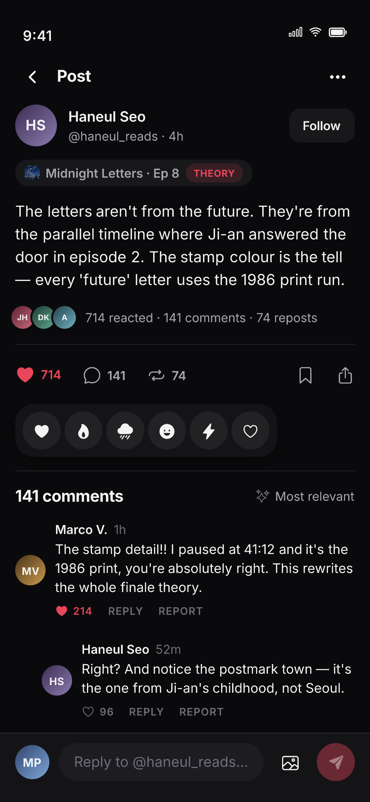
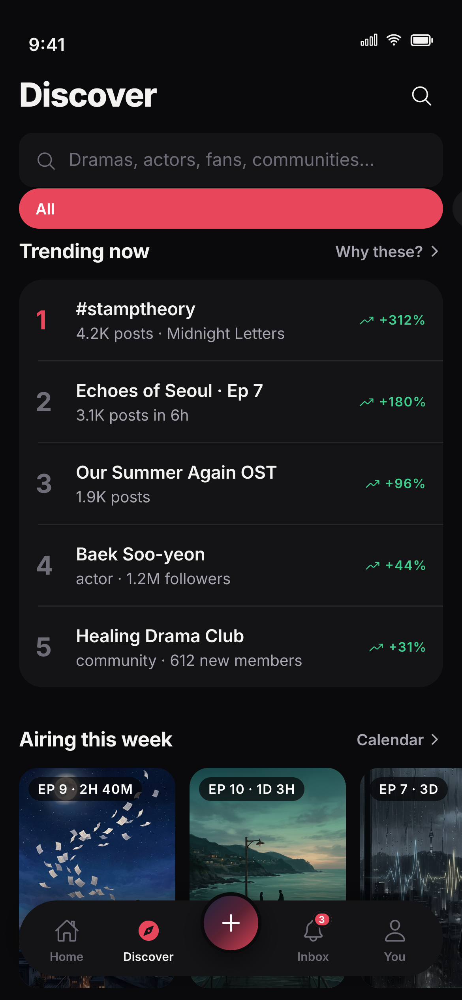
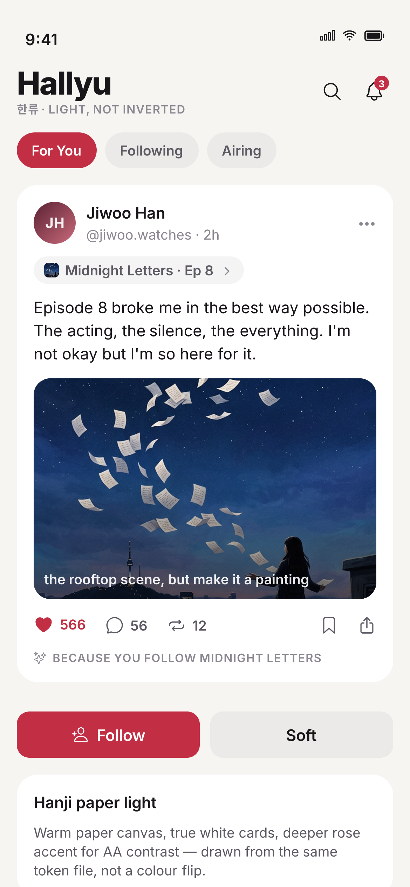
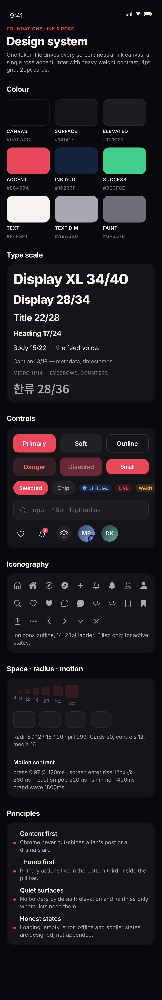

# Hallyu — Rendered Design Previews

> **These images are the design mockups for owner review — 28 frames of the
> proposed "Ink & Rose" redesign**, rendered at 3× (1170px wide) on a 390pt
> iPhone-class frame. `manifest.json` lists every frame with its metadata.

Frame width is a 390pt iPhone-class device. Frames taller than 844pt are scroll
sheets (settings, states, foundations) shown in full. Click a row to open the
frame.

## Social

| # | Screen | Frame | File |
|---|---|---|---|
| 15 | Post detail · comments | 390×844pt | [15-post-detail.png](./15-post-detail.png) |

## Highlights (inline)

| Home · For You | Drama hub | Post detail |
|---|---|---|
|  |  |  |

| Discover | Light mode | Design system (top) |
|---|---|---|
|  |  |  |

## Reading a frame

Every frame follows the "Ink & Rose" language: neutral ink canvas, single rose
accent, Inter weight contrast, 4pt grid, 20pt cards, Ionicons outline. Light
mode is drawn from the same tokens, not inverted. Placeholder key art (generated
assets in `docs/design-assets/`) stands in for licensed posters until the TMDB
pipeline exists;
all people and titles are fictional.
